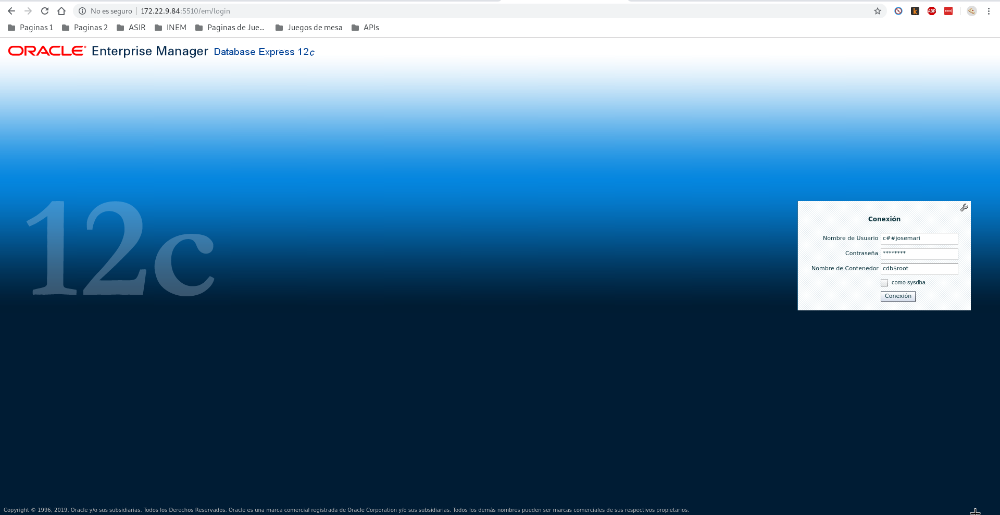
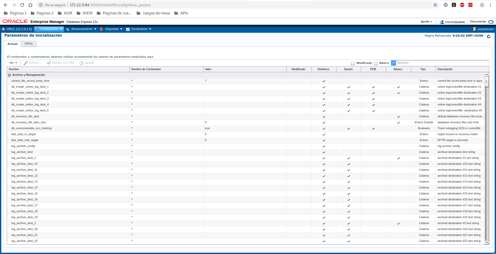

# Instalación de Oracle Enterprise Manager y prueba desde un cliente remoto
Se va a comprobar el funcionamiento de Oracle Enterprise Manager de un servidor Oracle alojado en un Debian Jessie en un cliente remoto en Debian Buster.

### Configuración en el servidor
Antes de empezar, hay que configurar las variables de entorno. Esta acción ya se realizó tras la instalación de Oracle, fondigurando el fichero /etc/bash.bashrc:
~~~
## Nombre del equipo ##
export ORACLE_HOSTNAME=localhost
## Usuario con permiso en archivos Oracle. ##
export ORACLE_OWNER=oracle
## Directorio que almacenará los distintos servicios de Oracle. ##
export ORACLE_BASE=/opt/oracle
## Directorio que almacenará la base de datos Oracle. ##
export ORACLE_HOME=/opt/oracle/product/12.2.0.1/dbhome_1
## Nombre único de la base de datos. ##
export ORACLE_UNQNAME=oraname
## Identificador de servicio de escucha. ##
export ORACLE_SID=orasid
~~~

### Prueba de funcionamiento
Teniendo configurado el servicio de escucha y con la base de datos disponible de forma remota, se comprueba la conectividad desde un navegador en otra máquina. Para ello se introduce la IP de la máquina servidora, el puerto, /em.

Para que se ejecute la aplicación, antes se tendrá que instalar algunos pluggins según el navegador que se utilice.

La primera pantalla, el login, se introduce el nombre de usuario desde el que vamos a acceder, la contraseña y el nombre del contenedor de la base de datos.

